# Procure‑to‑Pay (Purchase Request → Payment) — User Workflow Guide

**System:** Custom Odoo 15 Procurement & Spend‑Management Suite
**Audience:** Business users, approvers, buyers, finance, vendors, and process owners
**Scope:** The complete journey of a spend — from raising a Purchase Request, through approvals, sourcing/contracting, purchase orders, goods receipt, vendor billing, and final payment.

> This is a **functional / user‑level** document. It explains *what each role does*, *what the system does for them*, and *how a request moves from one desk to the next*. Technical model/field names are shown in `monospace` only where it helps you locate a screen or trace a record. Every process has a Mermaid diagram you can read top‑to‑bottom.

---

## Table of contents

- [1. What this application is](#1-what-this-application-is)
  - [1.1 How the modules connect (architecture map)](#11-how-the-modules-connect-architecture-map)
- [2. The organizational backbone](#2-the-organizational-backbone)
- [3. The Approval Engine (the heart of the system)](#3-the-approval-engine-the-heart-of-the-system)
  - [3.1 How a workflow rule is defined](#31-how-a-workflow-rule-is-defined)
  - [3.2 How approvers are chosen at run‑time](#32-how-approvers-are-chosen-at-runtime)
- [4. Roles & responsibilities](#4-roles--responsibilities)
- [5. The Pending Actions inbox — the daily driver](#5-the-pending-actions-inbox--the-daily-driver)
- [6. Stage 1 — Purchase Request (PR)](#6-stage-1--purchase-request-pr)
  - [6.1 What the initiator fills in](#61-what-the-initiator-fills-in)
  - [6.2 PR status lifecycle](#62-pr-status-lifecycle)
  - [6.3 What happens on submit](#63-what-happens-on-submit)
- [7. Stage 2 — Contract Request & Sourcing](#7-stage-2--contract-request--sourcing)
  - [7.1 Three contracting methods](#71-three-contracting-methods)
  - [7.2 Contract Request status lifecycle](#72-contract-request-status-lifecycle)
  - [7.3 The vendor side (Vendor Portal)](#73-the-vendor-side-vendor-portal)
- [8. Stage 3 — Rate Contract](#8-stage-3--rate-contract)
- [9. Stage 4 — Purchase Order (PO)](#9-stage-4--purchase-order-po)
- [10. Stage 5 — Goods Receipt (GRN)](#10-stage-5--goods-receipt-grn)
- [11. Stage 6 — Vendor Bill (Invoice) & Payment](#11-stage-6--vendor-bill-invoice--payment)
  - [11.1 Invoice / Payment status lifecycle](#111-invoice--payment-status-lifecycle)
- [12. Budget control](#12-budget-control)
- [13. Cross‑cutting capabilities (available across stages)](#13-crosscutting-capabilities-available-across-stages)
- [14. End‑to‑end walkthroughs](#14-endtoend-walkthroughs)
  - [14.1 Fast path — item already under a Rate Contract](#141-fast-path--item-already-under-a-rate-contract)
  - [14.2 Sourcing path — a brand‑new item](#142-sourcing-path--a-brandnew-item)
- [15. Status reference (quick lookup)](#15-status-reference-quick-lookup)
- [16. Pain points this application solves](#16-pain-points-this-application-solves)
  - [16.1 Uncontrolled, unauthorized spend](#161-uncontrolled-unauthorized-spend)
  - [16.2 Budget overruns discovered too late](#162-budget-overruns-discovered-too-late)
  - [16.3 Slow, opaque approvals and "where is my request?"](#163-slow-opaque-approvals-and-where-is-my-request)
  - [16.4 Maverick / off‑contract buying and price leakage](#164-maverick--offcontract-buying-and-price-leakage)
  - [16.5 Weak, manual sourcing](#165-weak-manual-sourcing)
  - [16.6 Vendor coordination overhead](#166-vendor-coordination-overhead)
  - [16.7 Disconnected documents and broken traceability](#167-disconnected-documents-and-broken-traceability)
  - [16.8 Payment & compliance leakage](#168-payment--compliance-leakage)
  - [16.9 Multi‑company / multi‑branch complexity](#169-multicompany--multibranch-complexity)
  - [16.10 Audit, accountability, and CapEx governance](#1610-audit-accountability-and-capex-governance)
  - [16.11 Manual recurring purchasing](#1611-manual-recurring-purchasing)
- [17. Glossary](#17-glossary)
  - [17.1 Key terms](#171-key-terms)
  - [17.2 Module glossary](#172-module-glossary)

---

## 1. What this application is

This suite turns the company's buying process into a single, controlled, auditable digital pipeline. Instead of paper requisitions, email approvals, scattered quotation sheets, and manual payment chasing, **every purchase flows through one connected chain of records**, each handing off to the next automatically.

The chain it manages:

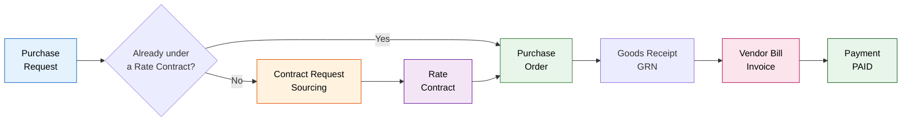

The system is **multi‑company and multi‑branch** (built for a dealership group operating several legal entities across states, e.g. *Popular Vehicles & Services Ltd – KL / TN / KA / TG*, with corporate and location branches). Who must approve what, and up to what value, is **configurable per company / branch / department / spend type / amount band** — without code changes.

### 1.1 How the modules connect (architecture map)

The suite is not one monolith but a **stack of cooperating custom modules** layered on Odoo core. `product_purchase` is the centrepiece (Purchase Request, Contract Request, Rate Contract, Purchase Order, Invoice, the workflow engine and budget). Everything below it provides foundations (org structure, accounting); everything above it adds capabilities (leasing, pending‑action routing, bidding, comparison, vendor collaboration, reporting). An arrow means **"builds on / depends on"** (Odoo core dependencies are collapsed into the foundation box to keep the picture readable).

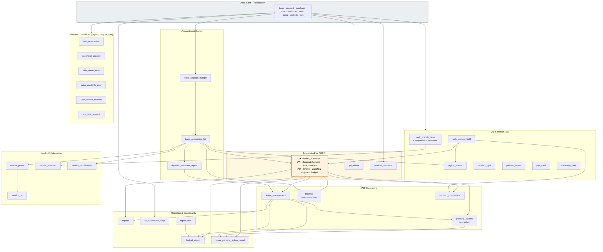

**Reading the layers**

| Layer | Modules | Role in the pipeline |
|-------|---------|----------------------|
| **Foundation** | Odoo core + `multi_branch_base`, `web_domain_field`, `region_master`, `product_type`, `partner_inherit`, `pan_card`, `company_filter` | Provide the company/branch structure, dynamic field domains, product master and partner data the whole flow depends on |
| **Accounting & Budget** | `base_account_budget` → `base_accounting_kit` → `dynamic_accounts_report` | Ledger, payments, asset/budget plumbing and financial reports |
| **P2P Core** | **`product_purchase`** (+ `po_inherit`, `product_contracts`) | The engine: requests, sourcing, contracts, POs, invoices, the approval workflow and budget checks |
| **P2P Extensions** | `lease_management`, `pending_actions`, `bidding`, `contract_comparison` | Add the task inbox that routes every hand‑off, live bidding, quotation comparison, and leasing |
| **Vendor Collaboration** | `vendor_portal` → `vendor_po`; `vendor_inherited`, `vendor_modification` | Vendor self‑service quoting, vendor POs and vendor master extensions |
| **Reporting** | `budget_report`, `buyer_pending_action_report`, `reports`, `ks_dashboard_ninja`, `report_xlsx` | Budget‑vs‑actual, buyer backlog, dashboards and Excel exports built on the operational data |
| **Platform / UX** | `web_responsive`, `password_security`, `hide_menu_user`, `odoo_readonly_user`, `user_mobile_number`, `om_data_remove` | Cross‑cutting usability, security and admin tools that depend only on Odoo core |

The critical spine to remember: **`base_account_budget` → `base_accounting_kit` → `product_purchase` → `lease_management` → `pending_actions`**. Most operational modules ultimately sit on `product_purchase`, and almost every action you take surfaces in `pending_actions` as a to‑do.

---

## 2. The organizational backbone

Before any approval can be routed, the system needs to know *the shape of the organization*. Four dimensions describe every person and every spend:

| Dimension | Model | Meaning | Example |
|-----------|-------|---------|---------|
| **Company** | `res.company` | Legal entity | Popular Vehicles & Services Ltd – KL |
| **Branch** | `res.branch` | Location / cost centre (each has a code; `COR` = Corporate) | Kochi Showroom, *KL Location Level* |
| **Department** | `hr.department` | Function | HO – IT, Branch – IT, SCM |
| **Designation** | `hr.job` | Job role | Purchase Head, Branch Manager, CFO |

Every user is mapped to one or more **(Company + Branch + Department + Designation)** rows on their user record (`res.users.line`). The system enforces **one user per designation per branch/department/company**, so a "Branch Manager of Kochi Showroom" always resolves to exactly one person.

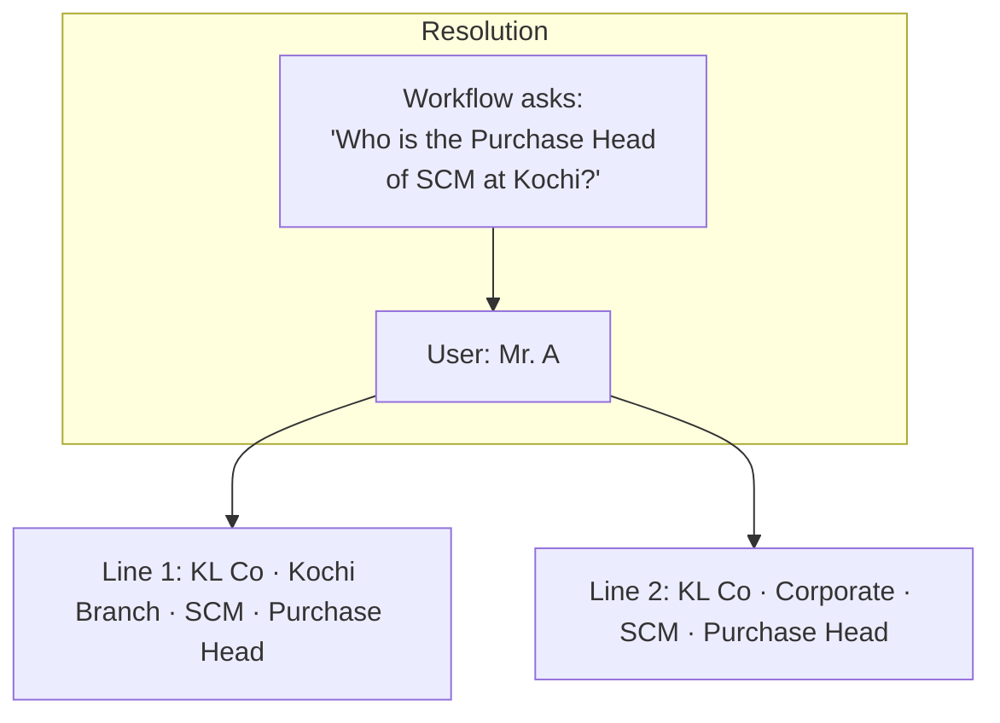

**Why this matters:** approval chains are defined against **roles (designations)**, never against named people. When someone changes job or leaves, you update one mapping row and every workflow instantly points to the right successor — no workflow re‑editing.

---

## 3. The Approval Engine (the heart of the system)

Almost every stage (PR, contract, invoice, payment, …) is gated by the **same configurable approval engine**.

### 3.1 How a workflow rule is defined

A rule (`pr.company`, labelled *Workflow*) answers: *"For this kind of spend, who signs off, in what order?"* It is keyed by:

- **Company + Branch + Department**
- **Expense Type** — CapEx or OpEx
- **Expense Category** — e.g. IT Hardware, Furniture, Services…
- **Amount band** — *From Amount → To Amount* (this is the Delegation‑of‑Authority / financial limit)
- **Workflow Type** — which stage the rule applies to:

  | Type | Used for |
  |------|----------|
  | `pr` | Purchase Request approval |
  | `need_cr` | "Need for Contract" approval (when items aren't yet contracted) |
  | `contract` | Contract Request (sourcing) approval |
  | `legal_workflow` | Legal vetting of a contract |
  | `purchase` | Purchase Order approval |
  | `renewal` | Rate‑contract renewal |
  | `lease` | Leasing approval |
  | `accounting` | Vendor‑bill (invoice) approval |
  | `payment` | Payment release approval |

Each rule carries an **ordered list of approver designations** (`pr.approve.users`: Company · Branch · Department · Designation · Order).

### 3.2 How approvers are chosen at run‑time

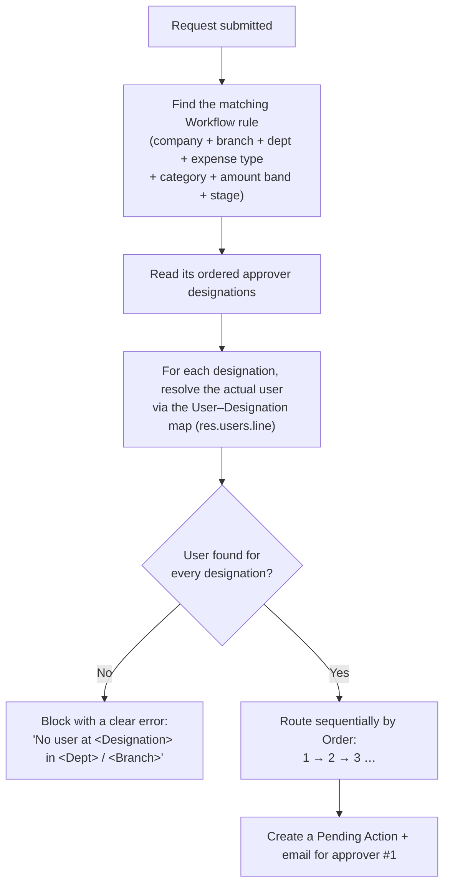

Key behaviours:
- **Amount‑banded:** a ₹50,000 request and a ₹50,00,000 request can follow completely different approval ladders because they fall in different amount bands.
- **Self‑skip:** if the person who raised the request is *also* in the approval chain, the system adjusts the order so they don't approve their own request.
- **Fail‑safe:** if a required role has no person mapped, submission is blocked with a precise message — preventing requests from silently dead‑ending.

---

## 4. Roles & responsibilities

| Role (security group) | Primary screen(s) | What they do |
|-----------------------|-------------------|--------------|
| **PR Initiator** | Purchase Request | Raises requisitions for their branch/department |
| **Approver** | Pending Actions | Approves / reverts / rejects / asks for info at their DOA level |
| **Purchase Head** | Contract Requests, Rate Contracts | Assigns buyers, oversees sourcing & contracts |
| **Buyer** | Contract Requests, Bidding, PO | Runs RFQ / negotiation / bidding, builds contracts & POs |
| **Finance** | Vendor Bills | Approves and releases payments |
| **Accounting Person** | Vendor Bills | Books the bill, captures TDS/deductions, voucher & UTR |
| **Fleet Manager** | Contracts / Lease | Leasing‑related contracts |
| **Vendor Portal User** | Vendor Portal | Submits quotations, participates in bids, views contracts/POs |
| **Master Admin** | Configuration | Maintains companies, branches, users, designations, workflows, budgets |

---

## 5. The Pending Actions inbox — the daily driver

Every hand‑off in the entire pipeline produces a **Pending Action** (`pending.actions`) — a single, unified "to‑do" assigned to the next responsible person(s). Alongside it the system raises an Odoo **activity** and sends an **email with a deep link** straight to the record.

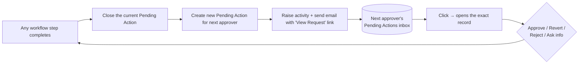

This means **no one has to hunt for work**. Whatever your role, your Pending Actions list is the complete, always‑current queue of everything waiting on you — across PRs, contracts, bills, and payments. Buyer/approver backlog is also surfaced through the *Buyer Pending Action Report*.

---

## 6. Stage 1 — Purchase Request (PR)

**Model:** `product.request` · **Menu:** *Purchase Request → Purchase Requests*

### 6.1 What the initiator fills in

- **Company, Bill‑To branch, Ship‑To branch, Department**
- **Expense Type** — CapEx / OpEx — and **Expense Category**
- **Purchase Plan** — Monthly or One Time
- **Purchase Type** (CapEx, from 2 Jul 2025 onward, mandatory): *Replacement*, *New requirement at existing location*, *Capacity addition / upgrade*, or *New Location* — each unlocks its own **business‑justification questionnaire** (e.g. replacement reason, book value, resale value; or business justification, break‑even period, expected revenue, capacity utilisation).
- **Product lines:** product, quantity, **need‑by date**, urgency (*within 30 / 15 / 5 days*), vendor(s), unit price, payment terms.

For each product line the system automatically checks whether an **active Rate Contract** already covers that product/branch/vendor. If so the line is flagged **In Contract** and the contracted price + lead time are pulled in; otherwise it is **New**.

### 6.2 PR status lifecycle

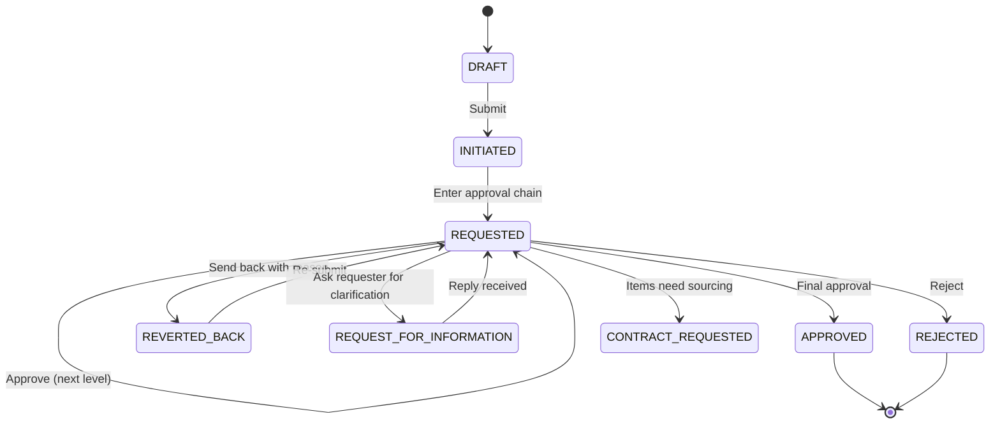

*(Status values: `draft`, `initiate`, `requested`, `revert`, `rfi`, `accepted` = APPROVED, `declined` = REJECTED, `wait` = CONTRACT REQUESTED, `lease`, `on_check`.)*

### 6.3 What happens on submit

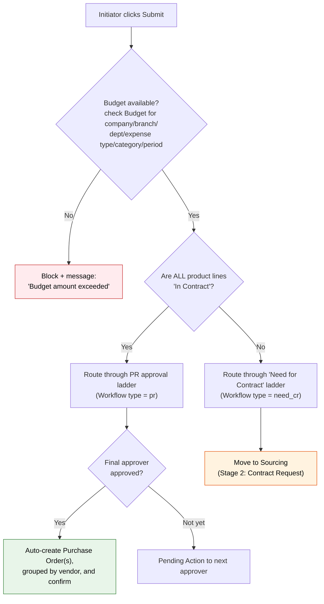

**Two fundamental paths diverge here:**
- **Fast path (everything already contracted):** PR approval → **Purchase Order is created and confirmed automatically**. No sourcing needed.
- **Sourcing path (one or more new items):** the request first secures a "we‑need‑a‑contract" approval, then enters the Contract Request / sourcing process to establish pricing and a vendor.

---

## 7. Stage 2 — Contract Request & Sourcing

**Model:** `tenders` (labelled *Contract Request*) · **Menu:** *Contracts → Contract Request*

When new items need pricing, a **Contract Request (CR)** is opened. The **Purchase Head assigns a Buyer** (Assign Buyer wizard); the buyer then chooses *how* to source.

### 7.1 Three contracting methods

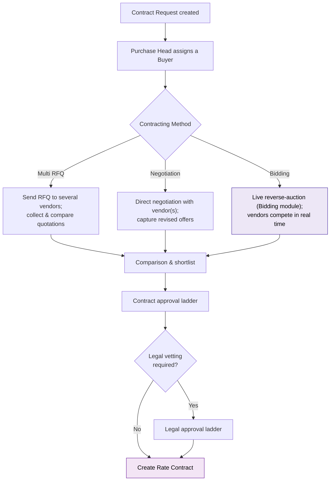

| Method | When used | Vendor experience |
|--------|-----------|-------------------|
| **Multi RFQ** | Several known suppliers; want competitive written quotes | Each vendor receives an RFQ in the **Vendor Portal** and submits a quotation |
| **Negotiation** | Sole/preferred vendor; iterative price talks | Vendor submits, buyer counters, offers are versioned |
| **Bidding** | Want live price competition | Vendors join a timed **reverse auction**; ranks update in real time; lowest/top vendor wins |

### 7.2 Contract Request status lifecycle

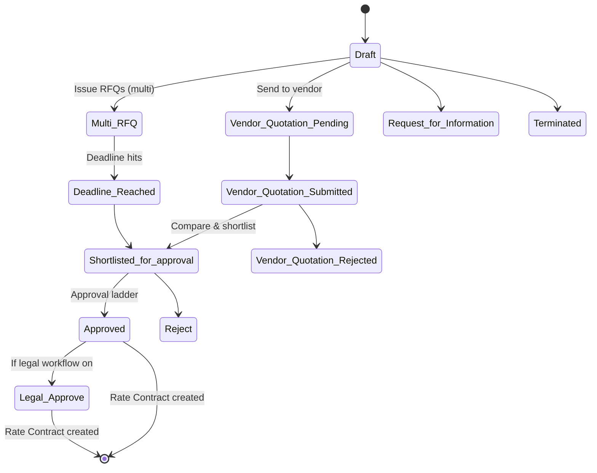

### 7.3 The vendor side (Vendor Portal)

Vendors are not emailed spreadsheets — they log into the **Vendor Portal** and act on a *Contract Request* record (`contract`): submit a quotation (Draft → Quotation Sent), enter negotiation, and ultimately see Accepted / Rejected / Expired. Buyers compare offers side‑by‑side (Contract Comparison, Negotiation Comparison, Price History) before shortlisting.

On final approval, the system **creates a Rate Contract** (`product.tender.line`) capturing the winning vendor, prices, validity, terms, and allowed companies/branches.

---

## 8. Stage 3 — Rate Contract

**Model:** `product.tender.line` (labelled *Rate Contracts*) · **Menu:** *Contracts → Rate Contracts*

A Rate Contract is the durable, reusable pricing agreement that makes future buying frictionless.

It records: vendor, **validity window** (start/end), **allowed companies & branches**, **product price lines**, payment terms, **lead time**, minimum quantity, recurring‑payment flag, and assigned buyers.

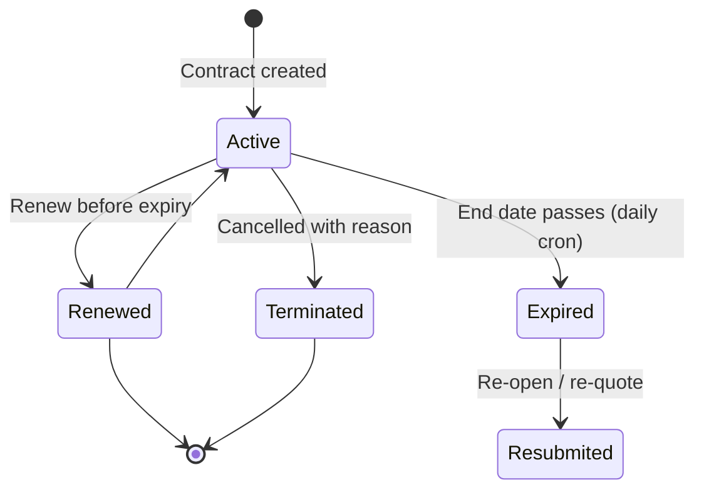

**Why it's powerful:** once a Rate Contract is Active, any *future* Purchase Request for those products at those branches is automatically flagged **In Contract** and pre‑filled with the agreed price — so it takes the **fast path** straight to a Purchase Order. Automated jobs (crons) handle the lifecycle:

- **Daily** — expire contracts past their end date and prompt for renewal.
- **Monthly** — auto‑generate recurring Purchase Orders for monthly/recurring contracts (including to assigned users).
- **Every 10 minutes** — chase vendor response deadlines on open contract requests.

---

## 9. Stage 4 — Purchase Order (PO)

**Model:** `purchase.order`

A PO is raised in one of three ways:
1. **Automatically** when an *all‑in‑contract* PR is finally approved (grouped by vendor, then confirmed).
2. **Automatically** by the monthly cron for recurring rate contracts.
3. **By a buyer** off a newly approved contract.

Each PO carries the full context: **Bill‑To / Ship‑To branch, department, expense type & category, the originating PR, the consumed budget, and the source contract(s)**.

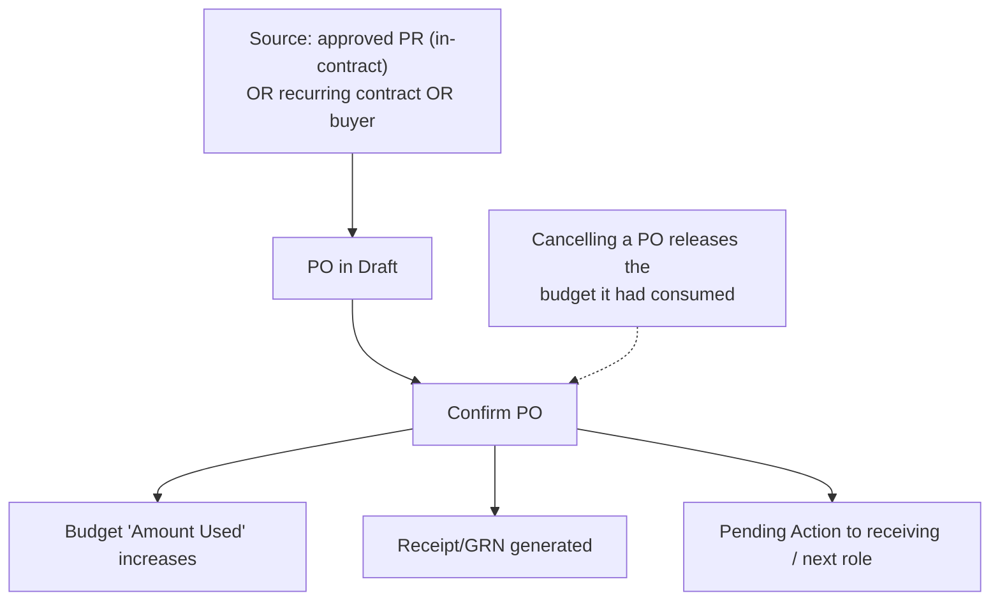

Budget control is two‑way: confirming a PO **consumes** budget; cancelling a PO (or cancelling the whole request) **releases** it back.

---

## 10. Stage 5 — Goods Receipt (GRN)

**Model:** `stock.picking`

On PO confirmation, Odoo creates an incoming **receipt** at the Ship‑To location. The warehouse/receiving user records what physically arrived; a Pending Action signals them to do so. Receipt of goods is what makes a vendor bill payable downstream. (If a request is cancelled mid‑flight, the system also unwinds reservations and cancels related pickings cleanly.)

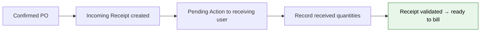

---

## 11. Stage 6 — Vendor Bill (Invoice) & Payment

**Model:** `account.move` (labelled *Invoice Request*)

This is where the spend becomes money out the door — and it carries **two stacked approval ladders** plus accounting capture.

When a bill is created against a PO, the system auto‑links the **PO, the originating PR, the contract(s), the branch, and the GST treatment**, then routes it through:
1. **Invoice approval** (Workflow type `accounting`) — confirms the bill is valid and matches the PO/receipt.
2. **Accounting capture** — Accounting Person books it, recording **TDS, other deductions, additional charges, voucher code**.
3. **Payment approval** (Workflow type `payment`) — Finance authorises the actual outflow.
4. **Payment** — UTR number and payment date recorded; status becomes **PAID**.

### 11.1 Invoice / Payment status lifecycle

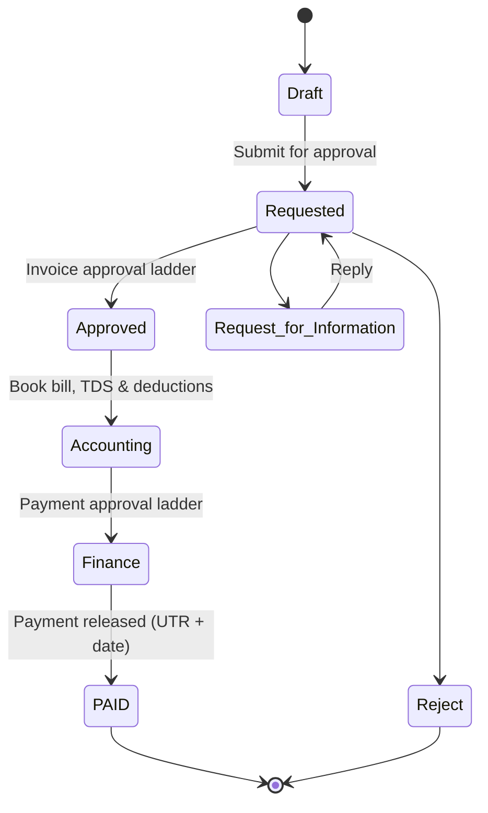

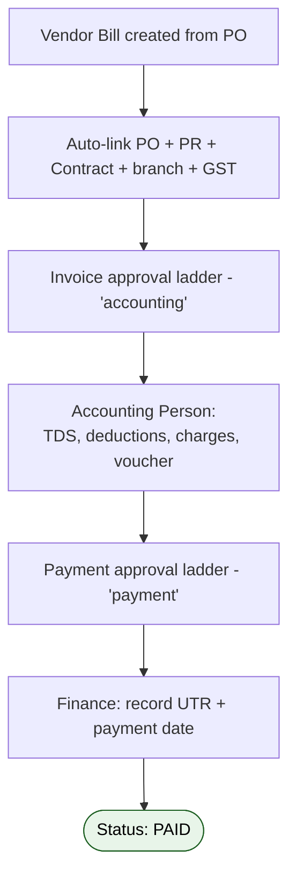

**Net effect:** by the time a payment is released, the system can show — on one record — the original request, who approved it and at what authority level, how it was sourced, the contract price, the PO, the goods received, the bill, the tax/TDS, and the approver of the payment itself. That is a complete, tamper‑evident audit trail for every rupee spent.

---

## 12. Budget control

**Model:** `product.request.budget` (this system uses its **own** budget model — not Odoo's standard budgeting).

A budget line is defined per **Company · Branch · Department · Expense Type · Expense Category · Period (From/To date)** with an **Amount Allotted**. The system tracks **Amount Used** and shows **Amount Remaining** live.

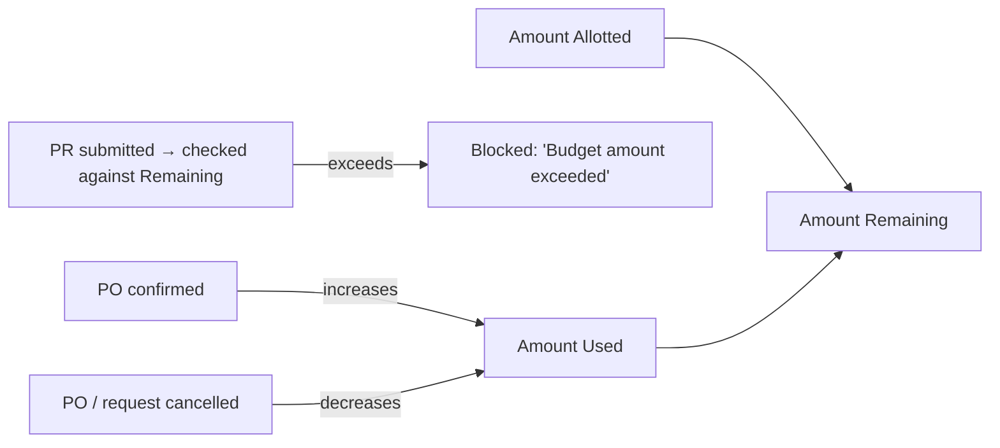

Budget is **checked at PR submission** (over‑budget requests are stopped with a message to seek a budget expansion) and **consumed at PO confirmation**, giving real‑time visibility into spend vs. allocation. Dedicated *Budget vs Actual* reporting sits on top of this model.

---

## 13. Cross‑cutting capabilities (available across stages)

These tools work consistently at the PR, Contract, and Invoice stages:

| Capability | What it does |
|-----------|--------------|
| **Request for Information (RFI)** | Any approver can pause and formally ask the requester/vendor a question; the thread captures the reply and resumes the flow |
| **Revert Back** | Send a request to a previous step with a mandatory reason, instead of outright rejecting |
| **Reject** | Terminate a request with a recorded reason |
| **Delegate User** | An approver can delegate their authority to another user (with admin oversight) |
| **Add Approver** | Inject an extra approver into a live workflow when extra sign‑off is warranted |
| **Deadline Extend** | Extend a sourcing/quotation deadline |
| **Price History** | Compare a vendor's current price against historical prices before deciding |
| **Remarks & Message Log** | Threaded notes + a full chatter/audit log (`mail.thread`) on every record |
| **Legal Workflow** | Optional legal vetting ladder before a contract is finalised |
| **Live Bidding** | Real‑time reverse auctions with vendor ranking and timers |

---

## 14. End‑to‑end walkthroughs

### 14.1 Fast path — item already under a Rate Contract

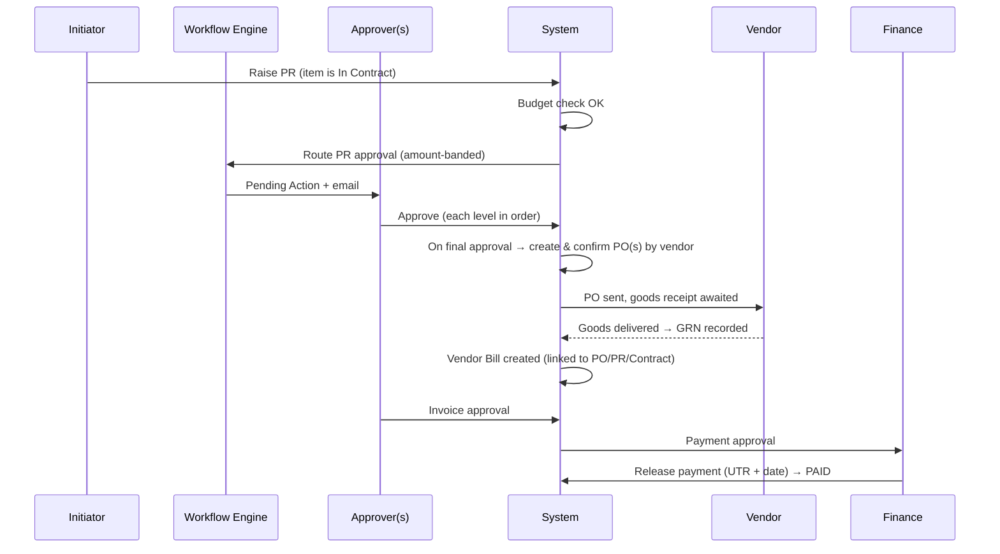

### 14.2 Sourcing path — a brand‑new item

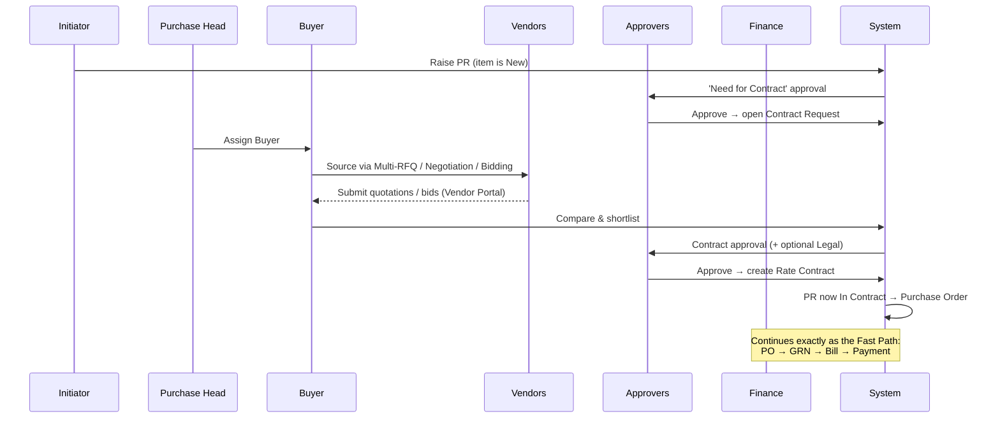

---

## 15. Status reference (quick lookup)

**Purchase Request** (`product.request.status`): Draft · Initiated · Requested · Reverted Back · On Check · Approved · Rejected · Request for Information · Contract Requested · Leased.

**Contract Request** (`tenders.state`): Draft · Multi‑RFQ · Vendor Quotation Pending · Vendor Quotation Submitted · Vendor Quotation Rejected · Deadline Reached · Shortlisted for Approval · Approved · Legal Approve · Reject · Not Shortlisted · Request for Information · Terminated.

**Rate Contract** (`product.tender.line.status`): Active · Expired · Resubmitted · Renewed · Terminated.

**Bidding** (`bid.request.status`): Draft · Accept · Reject · Live · Complete · Cancel (with per‑vendor Won/Lose).

**Vendor Bill / Payment** (`account.move.state`): Draft · Requested · Approved · Accounting · Finance · **PAID** · Reject · Request for Information · Cancelled.

---

## 16. Pain points this application solves

This section reviews — from a company / management perspective — the concrete problems the system removes.

### 16.1 Uncontrolled, unauthorized spend
- **Before:** purchases approved over email or verbally; limits unclear; people approving their own buys.
- **Now:** every spend passes a **role‑ and amount‑based Delegation‑of‑Authority ladder**. The amount band decides how many sign‑offs are needed; requesters are auto‑removed from approving their own requests; nothing reaches a PO without completing the chain.

### 16.2 Budget overruns discovered too late
- **Before:** spend reconciled against budget only at month/quarter end.
- **Now:** budget is **checked the moment a PR is raised** and **consumed when a PO is confirmed**, with live Amount Remaining and Budget‑vs‑Actual reporting. Over‑budget requests are stopped at the door.

### 16.3 Slow, opaque approvals and "where is my request?"
- **Before:** requisitions stuck in inboxes; no visibility on who's sitting on what.
- **Now:** a single **Pending Actions inbox** per person, plus activities and deep‑link emails. Buyer/approver backlogs are reported. Reverts, RFIs, deadline extensions and added approvers keep things moving without restarting the flow.

### 16.4 Maverick / off‑contract buying and price leakage
- **Before:** buyers re‑negotiate the same items repeatedly; prices vary by branch; no leverage.
- **Now:** **Rate Contracts** lock negotiated prices for defined products/branches/periods. Future requests auto‑detect the contract, pre‑fill the price, and skip re‑sourcing — capturing the agreed rate every time and surfacing price history.

### 16.5 Weak, manual sourcing
- **Before:** quotes gathered over email/phone; comparisons in spreadsheets; little competitive tension.
- **Now:** structured **Multi‑RFQ, Negotiation, and live Bidding (reverse auction)** with side‑by‑side comparison — driving genuine price competition and a documented basis for vendor selection.

### 16.6 Vendor coordination overhead
- **Before:** chasing vendors for quotes, POs, and statuses by email.
- **Now:** a **self‑service Vendor Portal** where vendors submit quotations, join bids, and view their contracts/POs — cutting back‑and‑forth and giving vendors a single source of truth.

### 16.7 Disconnected documents and broken traceability
- **Before:** PR, quote, PO, GRN, bill, and payment live in separate systems/sheets; reconciling them is manual.
- **Now:** every stage is **one linked chain** — the bill knows its PO, PR, contract, branch, and tax treatment. One click traces a payment all the way back to the original requisition and every approver in between.

### 16.8 Payment & compliance leakage
- **Before:** bills paid without independent verification; TDS/deductions applied inconsistently; no payment‑level authorization.
- **Now:** invoices carry **two ladders** (invoice approval *and* payment approval), structured capture of **TDS / deductions / voucher / UTR**, GST treatment inherited from the PO, and a finance sign‑off before any money moves.

### 16.9 Multi‑company / multi‑branch complexity
- **Before:** each entity/branch runs its own ad‑hoc process; consolidation is painful.
- **Now:** one platform spanning all companies and branches, with workflows, budgets, and contracts scoped precisely to each Company · Branch · Department · Category — without duplicating the system.

### 16.10 Audit, accountability, and CapEx governance
- **Before:** hard to prove who approved what, why a CapEx was justified, or whether process was followed.
- **Now:** full **chatter/audit trail** on every record; mandatory **CapEx business‑justification questionnaires** (replacement reason, break‑even, resale value, capacity utilisation); recorded reasons for reverts/rejections/terminations — an audit‑ready history end to end.

### 16.11 Manual recurring purchasing
- **Before:** someone remembers to raise monthly POs and renew contracts.
- **Now:** **scheduled jobs** auto‑generate recurring POs, expire/renew contracts, and chase vendor deadlines — removing routine clerical effort and missed renewals.

---

## 17. Glossary

### 17.1 Key terms

| Term | Meaning |
|------|---------|
| **PR** | Purchase Request / requisition (`product.request`) |
| **CR** | Contract Request — the sourcing record (`tenders`) |
| **Rate Contract** | Reusable negotiated price agreement (`product.tender.line`) |
| **PO** | Purchase Order (`purchase.order`) |
| **GRN** | Goods Receipt Note — the incoming receipt (`stock.picking`) |
| **Vendor Bill** | Supplier invoice (`account.move`) |
| **DOA** | Delegation of Authority — amount‑banded approval limits |
| **Workflow rule** | Configurable approval definition (`pr.company`) |
| **Designation** | Job role used to resolve approvers (`hr.job`) |
| **Pending Action** | A to‑do assigned to the next responsible user (`pending.actions`) |
| **RFI** | Request for Information — a formal clarification step |
| **CapEx / OpEx** | Capital vs Operating expenditure |
| **Expense Category** | Spend classification used in budgets & workflows (`expense.category`) |

### 17.2 Module glossary

Every custom module in `custom_addons/`, grouped by the layers shown in the architecture map (§1.1). **★ = the Procure‑to‑Pay core.**

**Procure‑to‑Pay core**

| Module | What it does |
|--------|--------------|
| **product_purchase** ★ | The heart of the suite. Defines the Purchase Request, Contract Request, Rate Contract, the dynamic amount‑banded approval workflow (`pr.company` + `pr.approve.users` + `res.users.line`), the budget model (`product.request.budget`), expense categories, and the extensions to Purchase Order and Vendor Bill. Everything else orbits this module. |
| **po_inherit** | Extends the Purchase Order with Bill‑To/Ship‑To branch, expense type & category, PR and budget links, and per‑company vendor pricelists. |
| **product_contracts** | Supporting product‑contract definitions and links used during contracting. |

**P2P extensions**

| Module | What it does |
|--------|--------------|
| **pending_actions** | The unified task inbox (`pending.actions`). Every workflow hand‑off creates a to‑do for the next responsible user, with an activity and a deep‑link email. Drives day‑to‑day work across the whole pipeline. |
| **lease_management** | Leasing flows for leased assets, plus the master‑data security groups (Master Admin, PR edit rights, etc.) that the rest of the suite reuses. |
| **bidding** | Live reverse‑auction sourcing (`bid.request`, `bidding`): invited vendors compete on price in real time with live ranking, timers and won/lose outcomes. |
| **contract_comparison** | Side‑by‑side quotation comparison wizard (`contract.compare.wizard`) that ranks vendor offers by price, lead time and payment terms. |

**Org &amp; master data**

| Module | What it does |
|--------|--------------|
| **multi_branch_base** | Defines the Branch concept (`res.branch`) and multi‑branch operations across companies — the cost‑centre backbone of routing and budgets. |
| **region_master** | Region / division / subdivision masters (`region.masters`, `division.masters`, `subdivision.masters`) and per‑vendor PR limits (`vendor.limit`). |
| **web_domain_field** | Enables dynamic domains on form fields; powers the cascading dropdowns (Company → Branch → Department → Designation) used throughout the suite. |
| **product_type** | Adds product type / classification (`product.types`) on product templates. |
| **partner_inherit** | Extensions to the partner (`res.partner`) and user (`res.users`) master records. |
| **pan_card** | Indian tax‑compliance fields/validation — PAN on partners, companies, bank accounts and invoices. |
| **company_filter** | Multi‑company usability tool to filter records/users by company. |

**Accounting &amp; budget**

| Module | What it does |
|--------|--------------|
| **base_account_budget** | Base accounting‑budget management (Community budgeting) — foundation budget plumbing. |
| **base_accounting_kit** | Full accounting kit (assets, recurring payments, post‑dated cheques, bank reconciliation, financial reports); a foundation many modules depend on. |
| **dynamic_accounts_report** | Dynamic, drill‑down financial reports (P&amp;L, balance sheet, ledgers). |

**Vendor collaboration**

| Module | What it does |
|--------|--------------|
| **vendor_portal** | Vendor self‑service portal — vendors submit quotations, participate in bids, and view their contracts and POs. |
| **vendor_po** | Vendor‑facing purchase‑order features, incl. delivery/advance‑shipment commitment dates and bill attachments. |
| **vendor_inherited** | Vendor master extensions tied to branches/regions. |
| **vendor_modification** | Vendor master modification / approval tooling on `res.partner`. |

**Reporting &amp; dashboards**

| Module | What it does |
|--------|--------------|
| **budget_report** | Budget‑vs‑Actual reporting built on `product.request.budget`, with Excel export. |
| **buyer_pending_action_report** | Buyer backlog / pending‑action report for the purchase team. |
| **reports** | Custom operational reports across the purchase chain (extends `purchase.order`, etc.). |
| **ks_dashboard_ninja** | Configurable KPI dashboards (tiles, charts). |
| **report_xlsx** | Framework that lets other modules generate Excel (XLSX) report exports. |

**Platform / UX utilities** (depend only on Odoo core)

| Module | What it does |
|--------|--------------|
| **web_responsive** | Modern, responsive (mobile‑friendly) Odoo backend UI. |
| **password_security** | Password‑policy enforcement (expiry, complexity, history, lockout). |
| **hide_menu_user** | Hide any menu item on a per‑user basis. |
| **odoo_readonly_user** | Grant selected users read‑only access. |
| **user_mobile_number** | Adds a mobile‑number field to users. |
| **om_data_remove** | Admin utility to clean up / reset transactional data. |

---

*Document generated from a study of the custom modules in `custom_addons/` — principally `product_purchase`, with `bidding`, `pending_actions`, `lease_management`, `vendor_portal`, `contract_comparison`, and the budget/reporting modules. It describes the system as implemented; where a step is configurable (workflows, budgets, contracts), the exact behaviour depends on the master‑data setup for each company and branch.*
